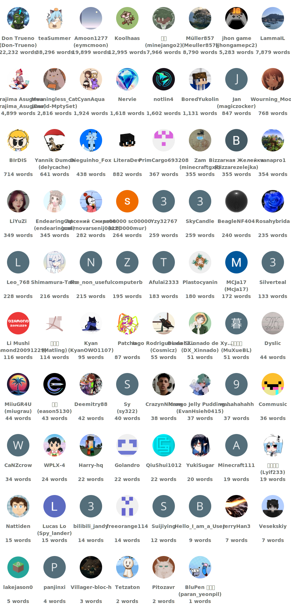

# 萬愚譯囊

[Deutsch](README.de.md) | [English](README.md) | [日本語](README.ja.md) | 文言 | [简体中文](README.zh-hans.md) | [繁體中文](README.zh-hant.md)

**用<span style="text-decoration: underline wavy;">礦藝大典</span>之坊間譯文，戲萬愚日之試版。**

[萬愚試版](https://lzh.minecraft.wiki/w/%E6%84%9A%E4%BA%BA%E7%AF%80%E7%AC%91%E8%AB%87)本無<u>群力</u>之官譯，然<span style="text-decoration: underline wavy;">大典</span>之眾為其新物作譯。此役集坊間之譯入戲，以促物名之共識。

## 功用

- 為萬愚試版供精確且時新之迻譯。
- 補佚缺之譯碼並修大舛（如正甲辰年二四週一四芋試版中 `shepard_potato.png` 為 `shepherd_potato.png` ）。

### 適用版

- [一五週一四甲](https://lzh.minecraft.wiki/w/一五週一四甲) （乙未年）
- [一點真視之預一](https://lzh.minecraft.wiki/w/爪哇版一點真視之預一) （丙申年）
- [躍然享件一點三四](https://lzh.minecraft.wiki/w/爪哇版躍然享件一點三四) （己亥年）
- [二〇週一四宇](https://lzh.minecraft.wiki/w/爪哇版二〇週一四宇) （庚子年）
- [二二週一三典](https://lzh.minecraft.wiki/w/二二週一三典) （壬寅年）
- [二三週一三暨](https://lzh.minecraft.wiki/w/二三週一三暨) （癸卯年）
- [二四週一四芋](https://lzh.minecraft.wiki/w/二四週一四芋) （甲辰年）
- [二五週一四藝礦](https://lzh.minecraft.wiki/w/二五週一四藝礦) （乙巳年）
- [二六週一四甲牧藝](https://lzh.minecraft.wiki/w/二六週一四甲牧藝) （丙午年）

[礦藝二點〇](https://lzh.minecraft.wiki/w/爪哇版二點〇)（癸巳年）**不**列此役，蓋其時尚無資囊之制。

### 文

諸譯皆出<u>群力</u>之眾；若有新迻譯，可薦於彼處。

| **碼**  | **語文**            | **本名**                  | **進度**                     | **既譯** | **既核** |
| ------- | ------------------- | ------------------------- | ---------------------------- | -------- | -------- |
| `de_de` | 隤䲭語              | Deutsch (Deutschland)     |  | 17% | 0% |
| `en_ud` | 倒置英吉利語        | ɥsᴉꞁᵷuƎ (uʍoᗡ ǝpᴉsd∩)     |  | 100% | 100% |
| `enp`   | 精粹英吉利語        | Anglish (Oned Riches)     |  | 55% | 55% |
| `es_es` | 佛朗機語            | Español (España)          |  | 0% | 0% |
| `fr_fr` | 方司語              | Français (France)         |  | 1% | 0% |
| `he_il` | 協婁語              | עברית (ישראל)             |  | 26% | 8% |
| `it_it` | 有犢語              | Italiano (Italia)         |  | 0% | 0% |
| `ja_jp` | 日本語              | 日本語 (日本)             |  | 100% | 29% |
| `ko_kr` | 朝鮮語              | 한국어 (대한민국)         |  | 82% | 4% |
| `lzh`   | 文言                | 文言 (華夏)               |  | 100% | 56% |
| `nl_nl` | 卑蘭語              | Nederlands (Nederland)    |  | 2% | 0% |
| `pt_br` | <u>枋林</u>埠吐噶語 | Português (Brasil)        |  | 8% | 5% |
| `pt_pt` | 埠吐噶語            | Português (Portugal)      |  | 0% | 0% |
| `ru_ru` | 羅剎語              | Русский (Россия)          |  | 15% | 0% |
| `th_th` | 暹羅語              | ไทย (ประเทศไทย)           |  | 0% | 0% |
| `uk_ua` | 渥蓮語              | Українська (Україна)      |  | 0% | 0% |
| `zh_cn` | <u>華夏</u>通語     | 简体中文 (中国大陆)       |  | 100% | 98% |
| `zh_hk` | <u>香港</u>通語     | 繁體中文 (香港特別行政區) |  | 76% | 76% |
| `zh_tw` | <u>流求</u>通語     | 繁體中文 (台灣)           |  | 67% | 1% |

若欲增新語，可[立案GitHub](https://github.com/mc-wiki/mcaf-resourcepack/issues)。

## 用法

1. 訪[新布](https://github.com/mc-wiki/mcaf-resourcepack/releases/latest)之頁（三時一齊）或[<u>改囊閣</u>](https://modrinth.com/resourcepack/april-fools-translation)（七日一齊）。
2. 載資囊。
3. 裝諸戲中。

若不知，宜閱[<span style="text-decoration: underline wavy;">礦藝大典</span>教章](https://lzh.minecraft.wiki/w/%E6%95%99%E7%AB%A0/%E8%BC%89%E8%B3%87%E5%9B%8A)。

## 襄助

迻譯之役，皆在[<u>群力</u>](https://crowdin.com/project/mcaf-resourcepack)；可往彼處襄贊。彼處之譯，以時齊於此庫。

## 答客問

**問一：戲中見未譯之文，當奈何？**

答一：請赴[<u>群力</u>](https://crowdin.com/project/mcaf-resourcepack)襄贊迻譯。若彼處無此文，多為源碼所錮，非資囊所能及也。

**問二：吾見未譯之譯碼（如 `rule.food_restriction.air_block` ），何故？**

答二：此多因文檔佚失條目。請至[立案](https://github.com/mc-wiki/mcaf-resourcepack/issues)處報之。

**問三：欲增新語文之援，當如何？**

答三：可於[<u>群力</u>](https://crowdin.com/project/mcaf-resourcepack)請之。

<!-- The following content is specifically provided for zh_hk and lzh players, and can be omitted. -->

## 香港繁體與文言

香港繁體與文言之增修，溯及己亥七月廿二日所佈之十九周三四甲測版。是日晚於己亥二月廿六日躍然享件一點三四測版之時。

故自一五周一四甲至躍然享件一點三四：

* <u>群力</u>之事與自就之資囊中，猶存斯二語之檔，以利大典。
* 斯二語弗見於言文之目，尋常戲中不可用也。
* 若欲用之，請自易縮囊中之`pack.mcmeta`，其式如下（須去註釋）。

```jsonc
{
  "pack": {
    // 此段毋庸更易
  },
  "language": {
    "zh_hk": {
      // 15w14a之時易作"zh_HK"
      "name": "繁體中文",
      "region": "香港特別行政區"
    },
    "lzh": {
      "name": "文言",
      "region": "華夏"
    }
  }
}
```

<!-- OMIT END -->

## 譯者


