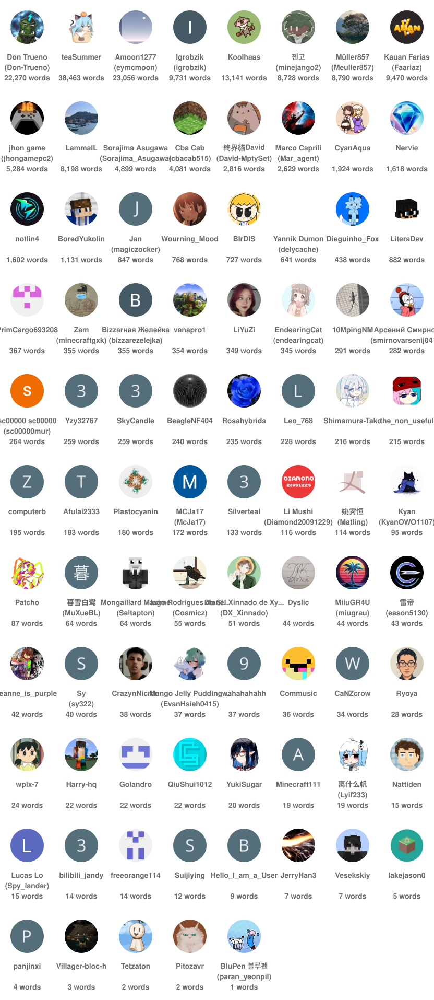

# Pacote de tradução do Dia da Mentira

[Deutsch](README.de.md) | [English](README.md) | Português | [日本語](README.ja.md) | [文言](README.lzh.md) | [简体中文](README.zh-hans.md) | [繁體中文](README.zh-hant.md)

**Jogue as snapshots de Dia da Mentira com traduções feitas pela comunidade da Minecraft Wiki.**

As [snapshots de Dia da Mentira](https://pt.minecraft.wiki/w/Piadas_do_Dia_da_Mentira) não são localizadas oficialmente através do Crowdin, mas a Minecraft Wiki fornece as traduções para seus recursos. Este projeto as tornam disponíveis no jogo num esforço para manter seus termos consistentes.

## Recursos

- Fornece uma localização precisa e atualizada para as snapshots de Dia da Mentira, seguindo o [guia de estilo brasileiro](https://docs.google.com/document/d/e/2PACX-1vQE3XcQiaGa8_FhiDzsxwvxf50riEY-uDKuQ6JAk6diKqD6wMUUxN9VUMLk4KdONJcczX2dn4TlDS3Q/pub).
- Corrige várias chaves de tradução ausentes e erros de digitação cruciais (por exemplo, corrigimos `shepard_potato.png` para `shepherd_potato.png` na 24w14potato).
<!-- TODO: List translations that has been overridden or does not present, missing keys and typos. -->

### Versões suportadas

- [15w14a](https://pt.minecraft.wiki/w/Edição_Java_15w14a) (2015)
- [1.RV-Pre1](https://pt.minecraft.wiki/w/Edição_Java_1.RV-Pre1) (2016)
- [3D Shareware v1.34](https://pt.minecraft.wiki/w/Edição_Java_3D_Shareware_v1.34) (2019)
- [20w14∞](https://pt.minecraft.wiki/w/Edição_Java_20w14∞) (2020)
- [22w13oneBlockAtATime](https://pt.minecraft.wiki/w/Edição_Java_22w13oneBlockAtATime) (2022)
- [23w13a_or_b](https://pt.minecraft.wiki/w/Edição_Java_23w13a_or_b) (2023)
- [24w14potato](https://pt.minecraft.wiki/w/Edição_Java_24w14potato) (2024)
- [25w14craftmine](https://pt.minecraft.wiki/w/Edição_Java_25w14craftmine) (2025)
- [26w14a](https://pt.minecraft.wiki/w/Edição_Java_26w14a) (2026)

[Minecraft 2.0](https://pt.minecraft.wiki/w/Edição_Java_2.0) (2013) **não está** incluído neste projeto devido aos pacotes de recursos estarem indisponíveis nessa versão.

### Idiomas suportados

As traduções são fornecidas pela comunidade através do [Crowdin](https://crowdin.com/project/mcaf-resourcepack/pt-BR); sugira novas lá.

| Código   | Idioma                | Endônimo               | Progresso                     | Traduzido  | Aprovado |
|----------|-----------------------|------------------------|-------------------------------|-----------:|---------:|
| `de_de`  | Alemão                | Deutsch (Deutschland)  |   | 18%  | 0% |
| `en_ud`  | Inglês (Ao contrário) | ɥsᴉꞁᵷuƎ (uʍoᗡ ǝpᴉsd∩)  |   | 100% | 100% |
| `enp`    | Inglês (Germânico)    | Anglish (Oned Riches)  |     | 70%  | 70% |
| `es_es`  | Espanhol              | Español (España)       |   | 2%   | 0% |
| `fil_ph` | Filipino              | Filipino (Pilipinas)   |  | 0%   | 0% |
| `fr_fr`  | Francês               | Français (France)      |   | 2%   | 0% |
| `he_il`  | Hebraico              | עברית (ישראל)          |   | 43%  | 9% |
| `it_it`  | Italiano              | Italiano (Italia)      |   | 25%  | 0% |
| `ja_jp`  | Japonês               | 日本語 (日本)           |   | 100% | 29% |
| `ko_kr`  | Coreano               | 한국어 (대한민국)         |   | 83%  | 11% |
| `lzh`    | Chinês literário      | 文言 (華夏)             |     | 100% | 63% |
| `nl_nl`  | Holandês              | Nederlands (Nederland) |   | 2%   | 0% |
| `pt_br`  | Português (Brasil)    | Português (Brasil)     |   | 43%  | 37% |
| `pt_pt`  | Português (Portugal)  | Português (Portugal)   |   | 0%   | 0% |
| `ru_ru`  | Russo                 | Русский (Россия)       |   | 100% | 0% |
| `th_th`  | Tailandês             | ไทย (ประเทศไทย)          |   | 0%   | 0% |
| `uk_ua`  | Ucraniano             | Українська (Україна)   |   | 0%   | 0% |
| `zh_cn`  | Chinês (Simplificado) | 简体中文 (中国大陆)       |   | 100% | 99% |
| `zh_hk`  | Chinês (Hong Kong)    | 繁體中文 (香港特別行政區)  |   | 78%  | 78% |
| `zh_tw`  | Chinês (Tradicional)  | 繁體中文 (台灣)          |   | 68%  | 3% |

Você pode pedir um novo idioma [criando uma *issue* no GitHub](https://github.com/mc-wiki/mcaf-resourcepack/issues).

## Como usar

1. Visite a página com o [último lançamento](https://github.com/mc-wiki/mcaf-resourcepack/releases/latest) (sincroniza a cada três horas) ou o [Modrinth](https://modrinth.com/resourcepack/april-fools-translation) (sincroniza a cada semana).
2. Baixe o pacote de recursos para o seu idioma.
3. Instale-o no seu jogo.

Precisa de ajuda com a instalação? Veja o [tutorial na wiki](https://pt.minecraft.wiki/w/Tutorial:Carregando_um_pacote_de_recursos).

## Contribuindo

As traduções ocorrem através do [Crowdin](https://crowdin.com/project/mcaf-resourcepack/pt-BR), onde você pode contribuir com outros [tradutores](#translators). Elas são sincronizadas neste repositório regularmente.

## Perguntas e respostas

**P1: Estou vendo textos sem traduções no jogo. O que devo fazer?**

R1: Contribua traduzindo-as no [Crowdin](https://crowdin.com/project/mcaf-resourcepack/pt-BR). Se o texto não estiver lá, é provável que esteja embutido no código do jogo e não pode ser corrigido pelo uso de um pacote de recursos.

**P2: Eu vejo chaves de traduções brutas (por exemplo, `rule.food_restriction.air_block`).**

R2: Isso normalmente significa que há uma entrada ausente nos arquivos de idioma. Relate este erro na seção *[Issues](https://github.com/mc-wiki/mcaf-resourcepack/issues)*.

**P3: Como posso adicionar suporte a um novo idioma?**

R3: Você pode pedir um novo idioma [no Crowdin](https://crowdin.com/project/mcaf-resourcepack).

## Tradutores

